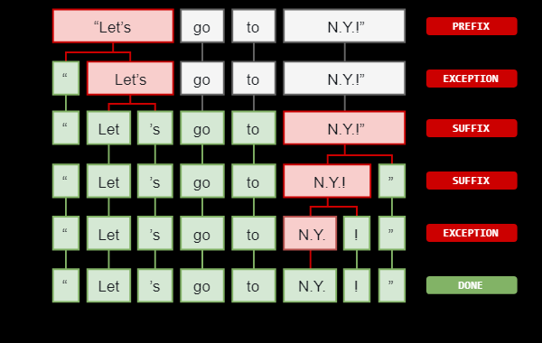
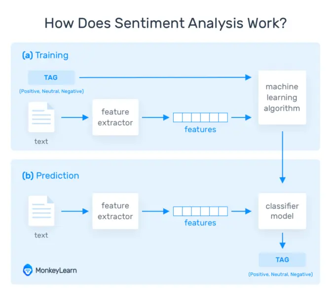

## Introduction to Natural Language Processing(NLP)
###  NLP Basic processing tasks
The processing of natural text/language has most common processing tasks such as :
- Language detection
- Tokenization
- Sentence segmentation
- Part-of-speech tagging (POST)
- Named entity recognition(NER)
- Chunking
- Stopwords removal
- Stemming
- Lemmatization
- Coreference Resolution
- Document Categorizer
1. **Language detection**:
    
     Language detection or identification is the problem of determining which natural language given content is in.
1. **Tokenization**:

    Tokenization is the process of demarcating and possibly classifying sections of a string of input characters. This is done by applying rules specific to each language. 
    ```sh
    # Example:
    1. Punctuation at the end of a sentence should be split off – whereas "U.K." should remain one token. 

    2."don't" does not contain whitespace, but should be split into two tokens, "do" and "n't", while "U.K." should always remain one token.
    ```
    - Tokenizers segment an input character sequence into tokens. 
    - Tokens are usually words, punctuation, numbers, etc.

    

1. **Sentence segmentation**:
    
    Also known as sentence breaking, sentence boundary detection is the problem in NLP of deciding where sentences begin and end. However, sentence boundary identification can be challenging due to the potential ambiguity of punctuation marks like ".", "?", "!", and sometimes emojis etc..
1. **Part-of-speech tagging (POST)**:
    
    This is the process of marking up a word in a text (corpus) as corresponding to a particular part of speech, based on both its definition and its context—i.e. its relationship with adjacent and related words in a phrase, sentence, or paragraph. A simplified form of this is commonly taught to school-age children, in the identification of words as `nouns`, `verbs`, `adjectives`, `adverbs`, etc. in the contest of the sentence or in relation to the other word present in the sentence.
1. **Named entity recognition(NER)**:

    This process is to locate and classify named entity mentioned in unstructured text into pre-defined categories such as person names, `organizations`, `locations`, `medical codes`, `time` `expressions`, `quantities`, `monetary values`, `percentages`, etc.
    
    *Notable NER platforms include:*

    - **GATE** supports NER across many languages and domains out of the box, usable via a graphical interface and a Java API.
    - **OpenNLP** includes rule-based and statistical named-entity recognition.
    - **SpaCy** features fast statistical NER as well as an open-source named-entity visualizer.

1. **Chunking**:

    Text chunking consists of dividing a text in syntactically correlated parts of words, like noun groups, verb groups, but does not specify their internal structure, nor their role in the main sentence.

1. **Stopwords removal**:
1. **Stemming**:
    
    Stemming refers to the removal of suffices, like "ing", "ly", "s", etc. by a simple rule-based approach. 
    
    ```sh
    # Examples :
    cats, catlike, catty --> cat
    Happily --> Happy
    Disfunctional --> Dysfunct
    Drags --> Drag
    Disapointed --> Disapoint
    ```
1. **Lemmatization**:
    Lemmatization is a more effective option than stemming because it converts the word into its root word, rather than just stripping the suffices. It makes use of the vocabulary and does a morphological analysis to obtain the root word. Therefore, we usually prefer using lemmatization over stemming.
    ```sh
    # Examples :
    0. go,went,gone,going--> go
    1. The word "better" has "good" as its lemma. This link is missed by stemming, as it requires a dictionary look-up.
    2. The word "walk" is the base form for the word "walking", and hence this is matched in both stemming and lemmatisation.
    3. The word "meeting" can be either the base form of a noun or a form of a verb ("to meet") depending on the context; e.g., "in our last meeting" or "We are meeting again tomorrow". 
    ```
    Unlike stemming, lemmatisation attempts to select the correct lemma depending on the context
1. **Coreference Resolution**:

    `Coreference resolution` is the task of finding all expressions that refer to the same entity in a text.
    ```sh
    #Example 
    In the sentence "Tom dropped the glass jar by accident and broke it", what does "it" refer to? I am sure you will immediately say that "it" refers to "the glass jar". This is a simple example of coreference resolution.
    ```
1. **Document Categorizer**:

    Document Categorizer can classify text(sentences) into pre-defined categories. The classifications are requirements-specific.
    ```sh
    #Example:
    For someone interested in Gross Margin, the sample text given below could be classified as GMDecrease:

    "Major acquisitions that have a lower gross margin than the existing network also had a negative impact on the overall gross margin, but it should improve following the implementation of its integration strategies."
  
    and the text below could be classified as GMIncrease

    "The upward movement of gross margin resulted from amounts pursuant to adjustments to obligations towards dealers."
    ```
    
###  NLP Advanced processing tasks
These tasks are usually required to build more [advanced text processing services](https://www.analyticsvidhya.com/blog/2018/02/the-different-methods-deal-text-data-predictive-python/).

- N-grams
- [Term Frequency(TF)](https://www.analyticsvidhya.com/blog/2015/04/information-retrieval-system-explained/)
- [Inverse Document Frequency(IDF)](https://www.analyticsvidhya.com/blog/2015/04/information-retrieval-system-explained/)
- [Term Frequency-Inverse Document Frequency (TF-IDF)](https://www.analyticsvidhya.com/blog/2015/04/information-retrieval-system-explained/)
- [Bag of Words](https://towardsdatascience.com/introduction-to-natural-language-processing-for-text-df845750fb63)
- [Sentiment Analysis](https://www.analyticsvidhya.com/blog/2018/07/hands-on-sentiment-analysis-dataset-python/)
- [Word Embedding](https://www.analyticsvidhya.com/blog/2017/06/word-embeddings-count-word2veec/)

Refer [this](https://www.analyticsvidhya.com/blog/2018/02/the-different-methods-deal-text-data-predictive-python/) to understand the above topics.


## Sentiment Analysis
Sentiment analysis is the interpretation and classification of emotions (e.g. positive, negative and neutral) within text data using text analysis techniques. Sentiment analysis allows businesses to identify customer sentiment toward products, brands or services in online conversations and feedback.

### Types of Sentiment Analysis
Sentiment analysis models focus on polarity (`positive`, `negative`, `neutral`) but also on feelings and emotions (`angry`, `happy`, `sad`, etc), and even on intentions (e.g. `interested` v. not `interested`).

Here are some of the most popular types of sentiment analysis:
1. Fine-grained Sentiment Analysis:
    
    If polarity precision is important to a business, it might be considered to expanding polarity categories to include:
    - Very positive --> Point 5
    - Positive --> Point 4
    - Neutral --> Point 3
    - Negative --> Point 2
    - Very negative --> Point 1
1. Emotion detection
    
    This type of sentiment analysis aims at detecting emotions, like `happiness`, `frustration`, `anger`, `sadness`, and so on. 

    ```sh
    One of the downsides of using lexicons is that people express emotions in different ways. 
    Some words that typically express anger and also express happiness, like 'bad' or 'kill' 
    
    Example : 
    1. Your product is so 'bad' or your customer support is 'killing' me.
    2. This is 'bad' ass (great product) or you are 'killing' the compitators.
    ```
1. Aspect-based Sentiment Analysis
    
    The big difference between **`sentiment analysis`** and **`aspect-based sentiment analysis`** is that the former only detects the sentiment of an overall text, while the latter analyzes each text to identify various aspects and determine the corresponding sentiment for each one.

    In other words, instead of classifying the overall sentiment of a text into positive or negative, aspect-based analysis allows us to associate specific sentiments with different aspects of a product or service. The results are more detailed, interesting and accurate because aspect-based analysis looks more closely at the information behind a text. 
    
    When we talk about aspects, we mean the attributes or components of a product or service e.g. `the user experience of a new product`, `the response time for a query or complaint` or 'the ease of integration of new software'.

    Here's a breakdown of what aspect-based sentiment analysis can extract:

    - Sentiments: positive or negative opinions about a particular aspect.
    - Aspects: the thing or topic that is being talked about.

    ```sh
    #Example

    'I love Slack UX but I wish the pricing was more accessible to small startups.'

    1. "I love Slack UX" – this opinion unit is 'Positive' (sentiment) and is about 'UX' (aspect)
    2. "but I wish the pricing was more accessible to small startups" – this opinion unit is 'Negative' (sentiment) and is about 'Pricing' (aspect)
    ```

    [Aspect-based sentiment analysis](https://monkeylearn.com/blog/aspect-based-sentiment-analysis/#what-is-aspect-based-sentiment-analysis) works in the same way as sentiment analysis. It takes all that data – emails, chats, customer surveys, social media posts, customer support tickets etc – and automatically structures it so that companies are able to interpret text entries from customers and gain meaningful insights. Not only does this help managers make key decisions based on insights from their customers, it also helps employees become more efficient and less frustrated with time-consuming, monotonous tasks.

    One of the bestway of getting the adjective related to one of the aspect is shown in [`2.4 Dependency Parsing`](https://www.analyticsvidhya.com/blog/2017/04/natural-language-processing-made-easy-using-spacy-%E2%80%8Bin-python/) (check all adjectives used with a word ) section of the example
    

### How Does Sentiment Analysis Work?
Sentiment analysis uses various Natural Language Processing (NLP) methods and algorithms. The main types of algorithms used include:

- **Rule-based** systems :
 
    These rules may include various techniques developed in computational linguistics, such as: `Stemming`, `tokenization`, `part-of-speech tagging` and `parsing`, `Lexicons` (i.e. lists of words and expressions).

    Here's a basic example of how a rule-based system works:

    - Defines two lists of polarized words (e.g. negative words such as bad, worst, ugly, etc and positive words such as good, best, beautiful, etc)
    - Counts the number of positive and negative words that appear in a given text.
    - If the number of positive word appearances is greater than the number of negative word appearances, the system returns a positive sentiment, and vice versa. If the numbers are even, the system will return a neutral sentiment.
    
    Rule-based systems are very naive since they don't take into account how words are combined in a sequence. Of course, more advanced processing techniques can be used, and new rules added to support new expressions and vocabulary. However, adding new rules may affect previous results, and the whole system can get very complex. Since rule-based systems often require fine-tuning and maintenance, they'll also need regular investments.


- **Automatic** systems:

    Automatic methods, contrary to rule-based systems, don't rely on manually crafted rules, but on machine learning techniques. A sentiment analysis task is usually modeled as a classification problem, whereby a classifier is fed a text and returns a category, e.g. positive, negative, or neutral.

    

    **The Training and Prediction Processes**

    In the training process (a), our model learns to associate a particular input (i.e. a text) to the corresponding output (tag) based on the test samples used for training. The feature extractor transfers the text input into a feature vector. Pairs of feature vectors and tags (e.g. positive, negative, or neutral) are fed into the machine learning algorithm to generate a model.
    
    In the prediction process (b), the feature extractor is used to transform unseen text inputs into feature vectors. These feature vectors are then fed into the model, which generates predicted tags (again, positive, negative, or neutral).
    
    **Feature Extraction from Text**

    The first step in a machine learning text classifier is to transform the text extraction or text vectorization, and the classical approach has been bag-of-words or bag-of-ngrams with their frequency.
    
    More recently, new feature extraction techniques have been applied based on word embeddings (also known as word vectors). This kind of representations makes it possible for words with similar meaning to have a similar representation, which can improve the performance of classifiers.
    
    **Classification Algorithms**

    The classification step usually involves a statistical model like Naïve Bayes, Logistic Regression, Support Vector Machines, or Neural Networks:
    
    - [Naïve Bayes](https://monkeylearn.com/blog/practical-explanation-naive-bayes-classifier/): a family of probabilistic algorithms that uses Bayes's Theorem to predict the category of a text.
    
    - [Linear Regression](https://hackernoon.com/supervised-machine-learning-linear-regression-in-python-541a5d8141ce): a very well-known algorithm in statistics used to predict some value (Y) given a set of features (X).
    
    - [Support Vector Machines](https://monkeylearn.com/blog/introduction-to-support-vector-machines-svm/): a non-probabilistic model which uses a representation of text examples as points in a multidimensional space. Examples of different categories (sentiments) are mapped to distinct regions within that space. Then, new texts are assigned a category based on similarities with existing texts and the regions they're mapped to.
    
    - [Deep Learning](https://machinelearningmastery.com/what-is-deep-learning/): a diverse set of algorithms that attempt to mimic the human brain, by employing artificial neural networks to process data.
- **Hybrid** systems that combine both rule-based and automatic approaches.
